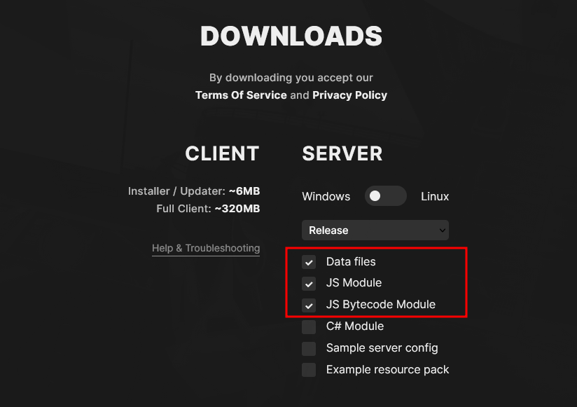
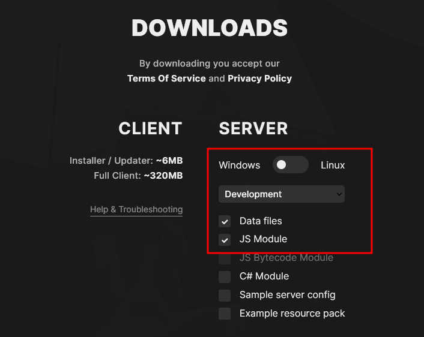

# Nightlife Alt-V

<details>
    <summary style="font-size: 2rem; font-weight: 700">Installation</summary>

## 1. Clone this repository
`git clone https://github.com/Nightlife-AltV/nightlife.git`

## 2. Install Alt-V Default Server
See [Install Stable Version](#install-stable-version)

## 3. Create .env file
- Duplicate the `.env.example` file and rename it to `.env`
- Fill in the required information

## 4. Install all dependencies
`npm install`

## 5. Start mysql (Docker)
`npm run start:mysql`

## 6. Start the server
`npm run start:dev`

## 7. Start coding

</details>

<details>
    <summary style="font-size: 2rem; font-weight: 700">Get easily an error id</summary>

Just open https://playcode.io/1667549 and copy the nmber that is generated each 2 seconds
</details>

<details>
    <summary style="font-size: 2rem; font-weight: 700">Sample server.toml</summary>

```toml
name = 'NightLife-City'
port = 7788
players = 128
# password = 'ultra-password'
announce = false
token = ''
gamemode = 'Freeroam'
website = 'example.com'
language = 'en'
description = 'NightLife-City'
modules = ['js-bytecode-module', 'js-module']
resources = ['chat', 'roleplay']
debug = true 
```
</details>

<details id="install-stable-version">
<summary style="font-size: 2rem; font-weight: 700">Install Stable Version</summary>

## Installation

1. Clone this repository `git clone https://github.com/Ghoster599/nightlife.git`
2. Install Alt-V Default Server

3. Move all folder and files from the downloaded server to the root folder of the GitHub repository

</details>

<details>
    <summary style="font-size: 2rem; font-weight: 700">Install Development Version</summary>

## Install Dev Version

1. Delete Following Folders and Files: 
    - cache
    - data
    - modules
    - AltV.Net.Host.runtimeconfig.json
    - altv-crash-handler.exe
    - server.log

2. Install Alt-V Dev Server

    

3. Move all folder and files from the downloaded server to the root folder of the GitHub repository <strong>(Not the Server.toml)</strong>
</details>

<details>
    <summary style="font-size: 2rem; font-weight: 700">Minify images</summary>

## Minify Images
Go To https://tinyjpg.com/ and minify all your new images
</details>

